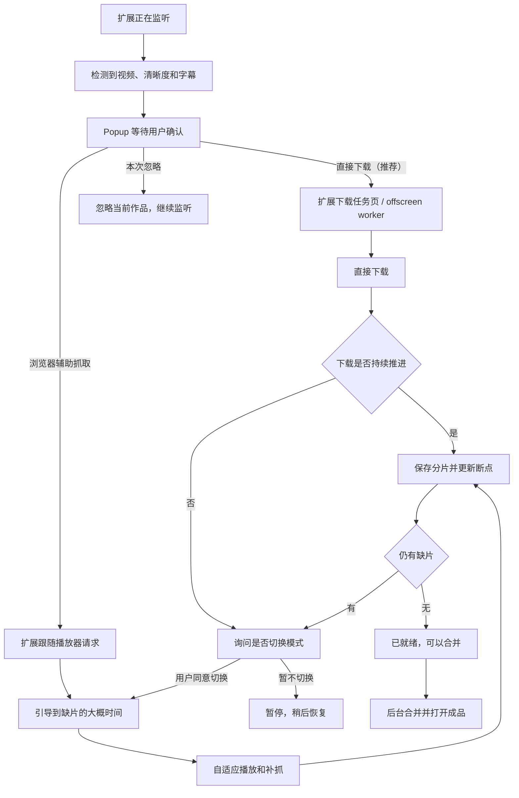

# Web Keeper 重构计划

> 状态：0.3.6 纯扩展主流程已实现；本文同时保留后续能力边界  
> 更新日期：2026-08-03  
> 依据：`docs/HANDOFF.md`、`docs/TODO.md` 与当前实际使用反馈  
> 冲突处理：本计划中的最新产品决策优先于旧文档中的历史建议。

## 1. 重构结论

本次优先在浏览器扩展内完成下载、补抓、字幕、断点账本和常见格式合并，并重构其上方的 **作品模型、下载编排、扩展交互和主界面**。Local Helper 不再是前置条件，只作为纯扩展实测失败后的可选增强层。

目标产品不再是一个要求用户理解 Candidate、Stream、Job、segment 的调试工具，而是一个以浏览器扩展为主要入口、支持直接下载和浏览器辅助抓取、可以可靠暂停与恢复的本地视频保存工具。

核心策略：

1. **下载方式由用户选择**：Popup 同时提供「直接下载（推荐）」和「浏览器辅助抓取」，系统可以解释和推荐，但不能替用户强制决定。
2. **直接下载只是推荐选项**：能够稳定枚举 HLS 分片时，直接下载通常操作更少；用户仍可从一开始就选择浏览器辅助抓取。
3. **切换模式必须再次确认**：直接下载因短期 URL、授权、播放器会话或动态 playlist 受阻时，提示用户选择「切换到浏览器辅助」或「暂停，稍后恢复」，不能自动切换。
4. **所有下载可恢复**：服务、浏览器或电脑重启后，只下载尚未完整保存的部分。
5. **稳定优先于极限速度**：浏览器补抓根据播放器加载状态和实际分片到达情况自适应推进，不盲目高速快进。
6. **一个视频只显示为一个作品**：不同清晰度、字幕、任务和成品都归入同一作品。
7. **默认只下载一个清晰度**：用户明确选择后才同时下载多个清晰度。
8. **字幕属于作品**：检测到字幕后直接显示在视频旁，默认随视频一起保存。
9. **不自动清理或迁移现有数据**：所有磁盘删除都由用户主动发起并单独确认。
10. **纯扩展优先**：发现、直接下载、浏览器辅助抓取、断点续传、文件直写和常见 HLS 合并优先在扩展内实现并在真实站点验证。
11. **Helper 延后且可选**：当前暂停继续编写和安装 Helper；只有实测证明失败来自浏览器 API 边界，而不是并发、短期 URL、播放器状态或站点适配问题时，才进入 Helper 阶段。
12. **Helper 跨平台、核心纯 Python**：若最终需要 Helper，优先提供可直接用 Python 运行的统一实现，再按 Windows、macOS、Debian 和鸿蒙的能力分别增加安装与启动适配；打包成独立程序只是可选发布形式。

### 1.1 最新产品定义（2026-08-03）

技术原型能下载不等于产品完成。后续迭代以“普通用户开箱即用”为第一验收维度：

1. **用户只安装并打开 Web Keeper**：不得要求用户理解或手动启动 Python、PowerShell、HTTP 服务、Native Host、端口或 ffmpeg。纯扩展可以完成时全部留在扩展；若未来确实需要本地组件，它也必须由正式安装包一并安装、自动启动、自动升级和自动诊断，对普通界面不可见。
2. **界面只讲用户任务**：只出现“发现视频、选择清晰度、开始下载、需要打开网页、正在恢复、可以播放、保存位置、删除内容”等概念。`Candidate`、`Job`、`segment`、`playlist`、`headers`、`localhost`、`Helper` 只允许出现在高级诊断页。
3. **直接保存优先，Capture 只是兜底**：不能把“持续播放并抓取”当成默认工作方式。系统按媒体直链、HLS、DASH/分轨流、站点适配器的顺序尝试直接下载；只有播放器会话确实不可替代时才推荐浏览器辅助。
4. **大部分普通网站可用**：目标覆盖直链 MP4/WebM/音频、HLS TS/fMP4（含普通 AES-128）、DASH/CMAF、音视频分轨、常见字幕和短期签名 URL。DRM、付费权限绕过和站点访问控制不在范围内。
5. **中文是正式语言，不是后补硬编码**：立即建立 `chrome.i18n`/消息资源结构，所有新增用户文案从资源读取；中文完整可用，英文作为第二语言。调试字段可暂缓翻译，但不能泄漏到普通流程。
6. **稳定性优先**：暂停、浏览器重启、Token 刷新、目录重新授权和任务页关闭都必须落到可恢复状态；不能无限重试、假装下载中或静默产生损坏成品。

`0.2.0` 是早期技术预览。当前 `0.3.6` 已完成 popup 确认、作品聚合下载中心、设置与中英文 i18n、直链 Range 续传、HLS/DASH/CMAF、常见分离音轨、字幕、缺片时间轴、智能补全、独立删除语义和本地发布包，并修复内部页面打开、popup 横向溢出、任务状态/速度误导、InPrivate 独立运行、本次忽略语义、音频清单覆盖视频主清单、未校验坏成品和 Windows 将未知 MP4 时长显示为 13 小时的问题。默认下载先写入扩展私有 OPFS 做断点与校验，再经浏览器 Downloads API 交付成品；自选文件夹仍作为高级选项。直接下载保留并排序完整 HTTP 媒体、HLS 与 DASH 候选；MPEG-TS 使用浏览器内组件转封装为 MP4，输出验证含视频轨后才能完成和清理。Capture 仍是用户可选的独立兜底路径。Helper 继续停用；DRM、复杂转码、非 CMAF/直播型 HLS 独立音轨、跨 Period/非标准 DASH 与真实目标站点适配仍受本文能力闸门约束。

## 2. 本次范围与暂不处理事项

### 本次范围

- 扩展 popup 的检测确认、继续/忽略、清晰度选择和按站点记忆。
- 扩展图标角标和当前标签页状态。
- 扩展内 offscreen/download worker、IndexedDB 断点账本、File System Access/OPFS 文件写入和常见格式 WASM 合并的可行性实现。
- 统一媒体解析层：直链文件、HLS、DASH/CMAF、音视频分轨与字幕。
- 站点能力探测与少量必要适配器；通用解析优先，站点特例不得污染核心任务模型。
- Work / Variant / Subtitle / Segment / DownloadSession 数据模型。
- 直接下载、卡住检测、暂停、恢复和浏览器辅助兜底。
- 新的作品、任务、存储与清理、Archive、设置、调试界面。
- 后台 Merge、缺片时间轴和下载流水。
- `chrome.i18n` 消息资源、中文完整文案与英文基础文案；业务代码不新增硬编码用户文案。

### 暂不处理

- DRM 破解或绕过站点访问控制。
- Confluence、Linear 等新站点适配器。
- 对现有 captures 做自动搬迁、重命名或清理。
- 全项目一次性迁移到全新的后端框架。
- 继续开发、安装或要求用户配置 Local Helper；现有实验性 Helper 代码先停放，不作为当前产品流程依赖。
- Windows、macOS、Debian、鸿蒙 Helper 的安装包与系统集成；这些在纯扩展能力验证后再做。
- 与本轮体验无关的大范围安全加固；但新的文件写入路径必须具备最基本的来源与目录边界检查。

## 3. 目标用户流程



用户需要选择下载方式，但界面使用容易理解的产品文案，不直接丢出内部术语：

- **直接下载（推荐）**：通常更省操作，不需要持续播放网页。
- **浏览器辅助抓取**：适合必须依赖播放器会话、或用户希望沿用实时播放抓片的情况。

系统只负责给出推荐和原因，不能自动替用户选择，也不能在直接下载受阻时未经确认切换模式。

## 4. 产品信息架构

普通用户只看到三个层级：

1. **扩展弹窗**：回答“当前页面找到了什么、推荐怎么保存、现在是否在进行”。
2. **下载中心**：回答“有哪些视频、进度如何、是否需要我操作、文件在哪里、如何暂停/继续/删除”。
3. **设置**：保存目录、默认清晰度、字幕、语言和高级兼容选项。

网络请求、播放列表、分片编号、HTTP 状态、Header 和解析器信息统一进入可折叠的“诊断信息”，默认不显示。旧 Python Dashboard 只作为开发与历史数据工具，不是新产品的主界面。

### 4.1 扩展 Popup

Popup 只保留：

- 扩展下载引擎状态；只有用户启用可选 Helper 时才显示本地引擎状态。
- 一个「监听」总开关。
- 当前标签页检测结果。
- 待确认作品卡片。
- 当前下载或补抓状态。
- 「打开主界面」。

默认隐藏：Server URL、workers、内部 job id、请求 URL、headers、历史失败计数等。

待确认卡片示例：

```text
检测到视频

作品：ABC-001
清晰度：● 1280×720  ○ 720×404  ○ 480×270
字幕：✓ 中文  ✓ English

[直接下载（推荐）]  [浏览器辅助抓取]
[本次忽略]
□ 记住本次选择，以后在这个网站自动使用
□ 同时下载多个清晰度（高级）
```

Popup 状态：

- `engine-ready`：扩展下载引擎可用，等待视频。
- `storage-permission`：需要用户选择或重新授权保存目录。
- `listening`：正在监听，等待视频。
- `pending`：检测到作品，等待继续或忽略。
- `capturing`：正在保存。
- `paused`：任务已暂停，可恢复。
- `needs-browser`：直接下载受阻，等待用户选择是否切换到网页辅助。
- `ready-to-merge`：分片已齐。
- `complete`：成品已生成。
- `error`：显示人话错误和恢复操作。
- `helper-available` / `helper-error`：仅在未来用户主动启用可选 Helper 后出现，不能阻塞纯扩展主流程。

### 4.2 主界面

最小导航：

1. **作品**：作品卡片、当前状态、推荐下一步操作。
2. **任务**：正在运行、等待用户、已暂停和最近完成的任务。
3. **存储与清理**：磁盘占用和所有手动删除入口。
4. **Archive**：FANBOX 和通用归档，保持与视频流程分离。
5. **设置**：目录授权、默认清晰度、站点规则、字幕、扩展引擎状态，以及未来可选的 Helper 状态。
6. **调试信息**：请求、分片、headers 状态、网络流水和内部计数。

每个作品只突出一个推荐主操作：

- `直接下载（推荐）`
- `浏览器辅助抓取`
- `打开网页补全`
- `恢复任务`
- `可以合并`
- `打开成品`

## 5. 核心数据模型

### 5.1 Work

同一视频的统一实体。建议标识为 `site + canonical_product_id`。

```text
Work
  id
  site
  product_id
  title
  source_page_url
  primary_variant_id
  capture_policy
  status
  recommended_action
  created_at
  updated_at
```

### 5.2 Variant

作品的某个清晰度，而不是独立作品。

```text
Variant
  id
  work_id
  resolution
  bandwidth
  codecs
  playlist_url
  playlist_type
  media_sequence
  expected_segments
  saved_segments
  disk_missing
  saved_bytes
  status
```

默认只有一个 Variant 被标记为下载目标。播放器自适应切换产生的其他清晰度只记录为“已检测”，不会自动开启多个完整下载任务。

### 5.3 SubtitleTrack

```text
SubtitleTrack
  id
  work_id
  language
  label
  format
  source_url
  output_path
  status
```

字幕默认跟随作品下载；仅当源站明确把字幕与特定 Variant 绑定时才记录关联。

### 5.4 Segment

断点续传的最小单位。

```text
Segment
  variant_id
  sequence
  uri_fingerprint
  byte_range
  duration
  start_seconds
  end_seconds
  local_path
  expected_bytes
  actual_bytes
  status
  attempts
  last_error
  updated_at
```

分片身份不能只依赖文件名；优先组合 media sequence、规范化 URI、byte range 和 playlist 上下文。

### 5.5 DownloadSession / Job

```text
DownloadSession
  id
  work_id
  selected_variant_ids
  mode: direct | browser-assisted | hybrid
  status
  progress
  last_progress_at
  pause_reason
  resumable
```

任务状态建议统一为：

```text
waiting-confirmation
queued
resolving
downloading
waiting-browser
browser-assisted
paused
merging
complete
warning
failed
cancelled
```

推荐新增独立 `downloads.sqlite` 保存作品、分片账本和任务状态。它只建立索引，不移动现有媒体文件，也不要求立即迁移旧 `state.json` 的全部内容。

## 6. 断点续传设计

每个分片保存流程：

1. 写入唯一 `.part` 文件。
2. 下载完成后检查大小、响应状态和最低有效条件。
3. 原子替换正式文件。
4. 立即更新 Segment 状态和 DownloadSession 断点。

恢复任务时：

1. 读取下载账本。
2. 低频校验目标目录，而不是每秒全盘扫描。
3. 已完整文件标记为 `saved` 并跳过。
4. `.part`、空文件或校验失败文件重新下载。
5. 只排队 `pending`、`missing`、`retryable` 分片。
6. URL 或授权过期时进入 `waiting-browser`，不进行无限失败重试。
7. 扩展重新观察到同一作品时刷新 headers/playlist，并从缺口继续。

现有 `data/captures` 采用懒导入：打开作品详情或恢复任务时建立索引；不自动移动、重命名或重新下载已有文件。

## 7. 直接下载与卡住检测

### 7.1 直接下载能力阶梯

对同一作品只创建一个用户任务，内部按能力逐层尝试并记录原因：

1. **媒体直链**：MP4、WebM、音频等支持 Range 时直接续传。
2. **HLS**：解析 master/media playlist，选择 Variant，处理 TS、fMP4、byterange、AES-128、字幕和滚动列表。
3. **DASH/CMAF**：解析 MPD、Representation、SegmentTemplate/Timeline，并合并分离的音视频轨。
4. **站点适配器**：只处理通用解析无法得到的页面元数据、短期 Token 刷新或请求签名，不绕过权限。
5. **浏览器辅助**：仅当后续媒体必须由播放器会话触发时，由用户确认后跟随实际播放补抓。
6. **可选本地增强**：只有浏览器资源或格式能力确实不足并通过能力闸门后才出现，且不得要求用户手动启动服务。

每层失败必须产出结构化原因，例如 `URL_EXPIRED`、`AUTH_REQUIRED`、`PLAYLIST_SLIDING`、`SEPARATE_TRACKS`、`UNSUPPORTED_ENCRYPTION`、`DRM_DETECTED`，再翻译成用户可理解的下一步操作；不能直接显示内部错误堆栈。

直接下载开始前先判断：

- master/media playlist 类型。
- 是否存在 `#EXT-X-ENDLIST`。
- 是否为 live/event 滚动 playlist。
- 分片是否带短期 token。
- 是否需要浏览器 Cookie、Authorization、Referer 或特定请求体。
- AES-128 key 与 IV 是否可获得。

卡住不能表现为无限期“下载中”。需要基于以下信号主动切换状态：

- 指定时间内没有新增成功分片或字节。
- playlist 连续刷新但没有新增可下载分片。
- 连续 401/403 表示授权失效。
- 大量 404 表示索引推断错误或滚动窗口已过去。
- 请求超时或连接错误达到保守阈值。

卡住后的用户提示：

```text
直接下载暂时无法继续
网站需要播放器会话来获取后续片段。

[打开网页并继续] [稍后恢复]
```

## 8. 浏览器辅助补抓

正式实现不再依赖固定 AHK 按键，而由扩展内容脚本控制当前网页的 video 元素。

补抓算法：

1. 根据 Segment duration/playlist 建立缺片时间轴。
2. 跳到第一个缺口稍前位置。
3. 等待播放器 `readyState`、buffered 范围和播放事件恢复。
4. 等待扩展实际观察到新的目标分片请求。
5. 确认有进展后再移动到下一个缺口。
6. 若加载跟不上，减小步长、增加等待或退回几秒。
7. 连续无进展则暂停，不继续把播放器推入卡死状态。

初始策略可以接近已经验证的“一秒前进十秒”，但必须动态调整：

- 播放稳定且持续出现新分片：保持当前节奏。
- `readyState` 降低、buffered 不足或未观察到新请求：立即减速或等待。
- 已完整区域：直接跳过。
- 后续补洞：只访问缺失区间，不从头扫完整视频。

用户随时可以停止辅助模式；已经保存的分片全部保留，任务转为 `paused` 或 `waiting-browser`。

## 9. 多清晰度与字幕规则

### 清晰度

- master playlist 可用时列出全部 Variant。
- 默认选择最高可用清晰度，或采用该站点上次选择。
- 同一作品的所有 Variant 显示在同一详情页。
- 只有勾选「同时下载多个清晰度」时才创建多个 Variant 子任务。
- 浏览器播放期间发生自适应码率切换时，只更新作品的 Variant 列表，不创建新作品。
- 补洞时可选择是否用低清分片临时填补高清缺口；必须明确标记，不静默混用。

### 字幕

- 检测到字幕后立即归入当前 Work。
- 默认随选中视频一起下载。
- UI 显示语言、格式、完整度和转换结果。
- 输出文件与成品视频采用相同基础文件名。
- 支持单独恢复、重新下载和转换字幕。

## 10. 纯扩展运行时与 Helper 能力边界

目标体验：默认只安装扩展，不运行 PowerShell、不注册本机服务，也能完成核心视频保存流程。

纯扩展职责：

- service worker 发现候选、维护 popup 状态并创建任务，不独自承担长时间网络与文件写入。
- offscreen 文档或专用下载页执行 playlist 刷新、分片下载、保守重试和 WASM 合并。
- IndexedDB 保存元数据和断点；File System Access 写入用户授权目录；OPFS 仅作临时缓存和崩溃恢复。
- 浏览器辅助模式跟随播放器实际进展，默认不做激进 burst-ahead；失败诊断必须区分站点限制、抓取策略和浏览器 API 边界。

平台目标：

| 平台 | 纯扩展主路线 | 未来可选 Helper |
|---|---|---|
| Windows | Chrome / Edge 优先验证 | 纯 Python 核心 + Native Messaging/注册脚本，可选独立打包 |
| macOS | Chrome / Edge 优先验证 | 同一 Python 核心 + manifest、权限、签名/公证适配 |
| Debian | Chrome / Chromium / Edge 优先验证 | 同一 Python 核心 + 用户级安装与可选 systemd 服务 |
| 鸿蒙 | 先确认实际设备和浏览器是否支持所需扩展 API | 先验证 Python 与 Native Messaging 等价能力；不提前承诺 |

在能力闸门通过前：

- 不继续扩展 `native-helper.js`、注册脚本或平台安装包。
- 不要求 `nativeMessaging` 成为正式扩展的必需权限。
- 不用“服务未启动”阻塞发现、用户选择和纯扩展下载。
- 现有 Python 服务可以作为开发对照和旧数据工具保留，但不是新主流程的启动前置条件。

如果将来启用 Helper，再定义稳定的命令协议，并确保同一份纯 Python 核心可在命令行直接运行；Native Messaging 只做短消息、启动和状态桥接，不复制下载业务逻辑。

## 11. API 与前端边界

新界面不应继续直接消费一个混杂所有数据的巨型 `/api/status`。

建议接口：

```text
GET  /api/overview                 轻量服务与当前活动
GET  /api/works                    作品摘要
GET  /api/works/<id>               单个作品详情
GET  /api/works/<id>/segments      分片与缺片时间轴
POST /api/works/<id>/resume        恢复下载
POST /api/works/<id>/pause         暂停下载
POST /api/works/<id>/merge         创建后台合并任务
POST /api/works/<id>/cleanup       明确范围的手动清理
GET  /api/jobs                     任务列表
POST /api/jobs/<id>/cancel         取消任务但默认保留文件
DELETE /api/jobs/<id>              只删除已结束任务记录
GET  /api/storage                  磁盘占用
GET  /api/network/events           轻量网络事件流
GET/PUT /api/settings              目录与用户设置
```

完整分片扫描只能按需或低频缓存执行；overview 和 popup 不得触发全量扫盘。

## 12. 目标文件结构

```text
extension/
  background.js
  popup.html
  popup.js
  detection-state.js
  download-engine.js
  download-worker.js
  offscreen.html
  offscreen.js
  storage.js
  mux/
  content/
    assisted-capture.js

hls_keeper/
  server.py                 HTTP 入口，逐步瘦身
  archive.py
  works.py                  Work/Variant/Subtitle 聚合
  ledger.py                 SQLite 下载账本
  downloads.py              直接下载与恢复编排
  assisted.py               浏览器辅助任务状态
  jobs.py                   统一任务模型
  merge.py                  后台 ffmpeg 合并
  web/
    index.html
    app.js
    styles.css
    i18n/
      zh-CN.json
      en.json

helper/                      可选增强层，纯扩展验证完成前暂停开发
  web_keeper_helper/        跨平台纯 Python 核心
  manifests/                各浏览器 Native Messaging manifest
  platform/
    windows/
    macos/
    debian/
    harmonyos/              先做能力验证，不预设支持 Native Messaging
```

旧 Dashboard 在迁移期间保留为 `/legacy`，新界面稳定后再移除。

## 13. 实施阶段

### 阶段 0：基线与契约

交付：

- 固化 Work、Variant、Subtitle、Segment、Job 状态定义。
- 固化 popup 状态转换和关键 API 契约。
- 建立 `/legacy` 回退策略。
- 为现有 captures 准备只读扫描器和测试样本。

验收：不改变现有下载行为和文件。

### 阶段 1：作品模型与下载账本

交付：

- `downloads.sqlite`。
- Work/Variant/Subtitle/Segment repository。
- 现有 captures 懒索引。
- 单元测试覆盖路径、分片身份、断点恢复和多清晰度聚合。

验收：同一作品只生成一个 Work；重启后账本仍能正确识别已保存分片。

### 阶段 2：Popup 确认流程

交付：

- 单一监听开关。
- pending detection 队列。
- 继续、忽略、按站点自动、清晰度和字幕选择。
- 图标角标；支持时尝试打开 popup，失败时保留角标。
- 同一作品去重和标签页导航清理。

验收：未知站点不会在确认前开始新下载；继续后能重放暂存的关键请求；忽略不影响其他标签页。

### 阶段 3：纯扩展下载运行时

交付：

- offscreen 文档或专用下载任务页承载长任务，service worker 只负责发现和编排。
- IndexedDB 保存 Work / Variant / Segment / Session 检查点；OPFS 只用于必要的临时分片，不长期占用现有大数据空间。
- 优先通过 File System Access 写入用户选择的目录，并处理目录授权恢复。
- 常见 HLS 使用扩展内 WASM remux/mux；不把复杂转码作为第一版前置条件。
- 记录浏览器观察与扩展重取的 HTTP 状态、响应大小、耗时、清晰度切换和播放器状态，用真实网站验证卡住原因。

验收：不安装 Helper 也能完成「检测 → 用户选择 → 下载/辅助抓取 → 中断恢复 → 保存文件」；浏览器或任务页关闭后的限制在界面中说明清楚。

### 阶段 3.5：产品外壳与 i18n 基础

交付：

- popup、下载中心、作品详情和设置页的信息架构与统一状态词典。
- `_locales/zh_CN/messages.json`、`_locales/en/messages.json` 和公共 `i18n.js`；manifest 与所有新增界面从消息资源取文案。
- 中文完整翻译、英文基础翻译、语言切换和缺失 key 检查。
- 普通界面移除 Candidate、Job、segment、playlist、Helper、localhost 等工程术语；诊断信息独立折叠。

验收：第一次使用者不看 README 能完成一次下载，并能准确说出当前状态、下一步操作、文件位置和删除范围。

### 阶段 4：直接下载与断点续传

交付：

- playlist 分类和 Variant 选择。
- 分片级 checkpoint、暂停和恢复。
- headers/token 刷新。
- 卡住检测和 `waiting-browser` 转换。
- 保守的并发、退避和失败上限。
- 直链文件 Range 续传、HLS 完整覆盖、DASH/CMAF 与音视频分轨基础支持。
- 通用解析器与站点适配器注册表；同一作品内部切换策略但不制造多个重复任务。

验收：中断后恢复只下载缺失部分；URL 过期时不会无限重试或假装仍在下载；在无 DRM 的代表性直链、HLS、DASH 和分轨样本上均可生成可播放成品。

### 阶段 5：浏览器辅助补抓

交付：

- 内容脚本控制 video。
- 缺片时间轴定位。
- 根据播放器缓冲和实际分片请求自适应推进。
- 用户暂停、恢复和失败引导。

验收：加载跟不上时会自动减速；只处理缺失区间；不会因固定高速 seek 长时间卡死播放器。

### 阶段 6：新主界面

交付：

- 将前端移出 `server.py`。
- 作品、任务、存储与清理、Archive、设置、调试导航。
- 中文默认界面。
- Work 卡片与单一推荐操作。

验收：用户不看文档也能说清当前作品状态、下一步操作和文件位置。

### 阶段 7：Merge、清理与可观测性

交付：

- Merge 后台任务、进度、防重复点击和结果卡。
- 统一的手动清理中心。
- 下载网络流水和筛选。
- 自定义捕获、输出和 Archive 目录。

验收：任务、记录、分片和成品删除入口含义明确；合并全过程可见。

### 阶段 8：纯扩展发布闭环

交付：

- 扩展包。
- 保存目录授权、浏览器保持开启、格式支持范围和失败诊断说明。
- Chrome/Edge 安装、升级与数据兼容；不出现“请启动服务/运行脚本”的普通用户步骤。
- 升级、卸载和故障诊断文档。

验收：完成「安装扩展 → 检测 → 确认 → 下载 → 恢复 → 补洞 → 合并 → 打开成品」闭环，不要求安装 Helper。

### 阶段 9：Helper 能力闸门与可选跨平台实现

只有阶段 3—8 在真实目标站点完成诊断后，满足至少一项才启动本阶段：

- 浏览器无法可靠复现目标请求上下文，且站点适配与保守重试仍不能解决。
- 目标格式必须使用原生 ffmpeg 或浏览器内 WASM 无法在可接受资源范围内处理。
- 用户明确需要浏览器关闭后继续、超大任务无人值守运行或管理既有本地 captures。
- 目标浏览器缺少所需的 File System Access、OPFS、offscreen 或等价能力。

交付顺序：

1. **纯 Python 版**：统一协议、下载账本和进程入口，可通过 `python -m ...` 运行；尽量保持业务代码无平台依赖。
2. **Windows 适配**：Native Messaging 注册、启动和可选独立打包。
3. **macOS 适配**：Chrome/Edge Native Messaging manifest、权限、签名/公证和可选 launchd 启动方式。
4. **Debian 适配**：Chrome/Chromium/Edge manifest 路径、用户级安装脚本和可选 systemd user service。
5. **鸿蒙适配**：先明确目标设备、浏览器扩展能力、Native Messaging 等价机制和 Python 运行环境；若不支持，评估本机服务、局域网桥接或保持纯扩展，不伪装成已兼容。

所有平台共享同一纯 Python 核心；平台脚本只负责注册、权限和启动。独立二进制不得取代可直接运行的纯 Python 发行方式。

## 14. 推荐提交切片

1. `refactor/ux-contract`
2. `refactor/download-ledger`
3. `refactor/popup-confirmation`
4. `refactor/extension-download-runtime`
5. `refactor/direct-resume`
6. `refactor/assisted-capture`
7. `refactor/web-shell`
8. `refactor/work-view`
9. `refactor/jobs-merge-storage`
10. `refactor/network-events`
11. `refactor/extension-release`
12. `optional/python-helper-core`（仅通过能力闸门后）
13. `optional/helper-platforms`（Windows → macOS → Debian → 鸿蒙能力验证）

每个切片都必须可以单独验证和回退，不允许以“大重写完成后再一起测试”的方式推进。

## 15. 测试与验收策略

### 自动测试

- playlist/master/media/byterange/AES-128 解析测试。
- Work 多清晰度和字幕聚合测试。
- 分片下载中断、`.part` 恢复和文件校验测试。
- 401/403、滚动 playlist、超时和卡住状态转换测试。
- popup detection 去重、继续、忽略和站点记忆测试。
- offscreen/download page 被回收、浏览器重启、目录权限失效、存储额度和 WASM 合并失败测试。
- API 使用临时目录，禁止触碰真实 captures。

### 大数据性能测试

- 使用模拟的十万级分片目录测试 overview、作品列表和详情扫描。
- popup/overview 响应不进行全盘扫描。
- 网络流水限制内存数量并对高频事件聚合。

### 用户验收

- 未安装 Helper 时可以完成核心下载流程。
- 扩展明确提示浏览器/任务页保持开启和目录授权状态。
- 检测到视频时能选择继续或忽略。
- 默认只下载一个清晰度，多个清晰度仍显示为同一作品。
- 字幕与视频出现在同一作品中。
- 直接下载卡住时会给出浏览器辅助入口。
- 浏览器、扩展或任务页重启后可以从持久化断点继续；若启用可选 Helper，其重启也不得丢失进度。
- 补抓会在加载跟不上时自动减速。
- 分片齐全时明确提示可以合并。
- 所有删除操作都明确说明影响范围，且不会自动清理历史数据。

## 16. 完成定义

重构完成不是指目录已经拆分，而是用户能够稳定完成以下流程：

1. 只安装和操作浏览器扩展即可使用核心下载流程，不要求先启动本地服务。
2. 检测视频后选择继续、忽略或记住站点规则。
3. 选择一个清晰度并自动获得字幕。
4. 用户可选择直接下载或浏览器辅助；界面推荐直接下载，但受阻时必须再次确认后才能切换模式。
5. 关闭并重新打开后从断点继续。
6. 缺片时知道回到视频哪个大概位置。
7. 完整后能够清楚地合并、找到并打开成品。
8. 能够区分删除任务记录、原始分片和成品文件。
